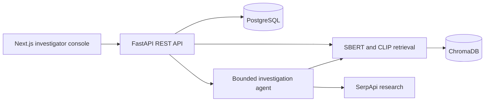
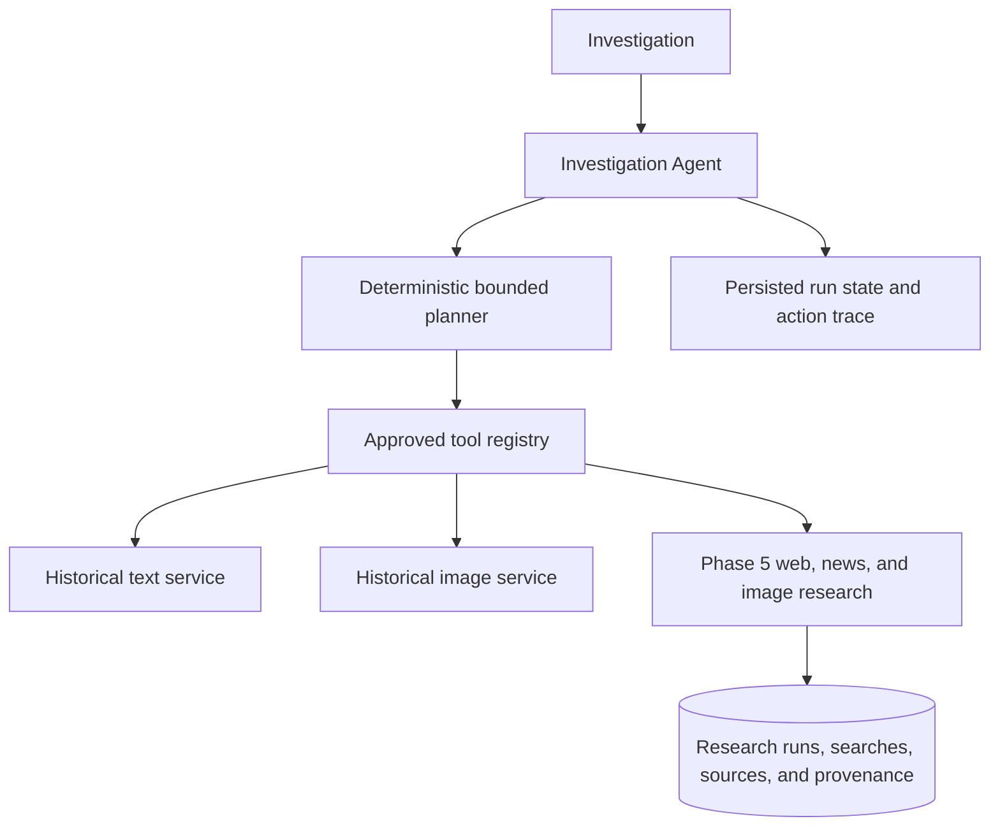

# ColdSync AI

ColdSync AI is an investigative research and evidence-organization system. It helps investigators connect newly submitted case information with historical cases and public web sources. It does not determine guilt, identify perpetrators, or replace professional investigators.

**Current status:** Phases 1–7 are implemented in code. Runtime database, migration, model, vector, provider, and full-stack verification remain environment-dependent and must be confirmed before deployment.

## Architecture



## Repository structure

- `apps/web`: Next.js App Router UI
- `apps/api`: FastAPI API, configuration, and initial PostgreSQL schema
- `docs/architecture.md`: system boundaries and implementation sequence
- `docker-compose.yml`: frontend, backend, PostgreSQL, and ChromaDB

## Run locally

1. Copy `.env.example` to `.env` and set a local PostgreSQL password.
2. Run `docker compose up --build`.
3. Open `http://localhost:3000`; API docs are at `http://localhost:8001/docs`.
4. Visit `/dashboard`, create an investigation, edit it on its detail page, and manage cases under `/investigations`.

The PostgreSQL migration is managed by Alembic and runs before the API starts. The first revision creates the structured `investigations` table and constrains status to `DRAFT`, `ACTIVE`, `COMPLETED`, or `ARCHIVED`.

## Phase 2 evidence management

Evidence supports investigator-entered text, image uploads (JPEG, PNG, WebP), document uploads (PDF and UTF-8 plain text), and metadata-only `VIDEO_METADATA` or `OTHER` records through the text evidence endpoint. Video files are not analyzed. Uploaded files are validated by extension, declared MIME type, and content checks; images are verified and basic dimensions/format are recorded. File content is stored outside PostgreSQL under server-generated investigation/evidence UUID directories. SHA-256 checksums and explicit `investigator_upload` / `investigator_entered` metadata are stored with each record. No embeddings, image recognition, document extraction, or AI processing runs in this phase.

Configure `EVIDENCE_STORAGE_DIR` (default `./data/evidence`) and `MAX_EVIDENCE_FILE_SIZE_MB` (default 15, allowed 1–100). Docker Compose mounts a persistent `evidence_data` volume. Supported upload types are `image/jpeg`, `image/png`, `image/webp`, `application/pdf`, and UTF-8 `text/plain`.

Evidence endpoints:

- `POST /api/v1/investigations/{id}/evidence`: text, video metadata, or other investigator-entered record
- `POST /api/v1/investigations/{id}/evidence/upload`: multipart file upload
- `GET /api/v1/investigations/{id}/evidence?type=IMAGE&processing_status=READY`: list/filter within an investigation
- `GET /api/v1/evidence/{id}` and `PATCH /api/v1/evidence/{id}`: retrieve/update metadata
- `GET /api/v1/evidence/{id}/content`: text payload or safe image/document content response
- `DELETE /api/v1/evidence/{id}`: remove the record and stored file

The `0002_evidence` Alembic revision creates the evidence table with an investigation foreign key and cascade behavior. Compose runs `alembic upgrade head` before serving requests. Backend tests: `cd apps/api && python -m pytest`.

Text entries become `READY` immediately. Stored image/document uploads are marked `READY` after type verification, checksum, and basic image metadata extraction. `VIDEO_METADATA` is only a metadata/reference record. Evidence deletion stages the stored file, commits the database deletion, then finalizes cleanup; investigation deletion also cleans up its evidence files. Storage keys are generated from UUIDs, and resolved paths are checked against the configured storage root.

## Phase 3 historical knowledge base

PostgreSQL stores normalized historical case records and remains authoritative. The importer accepts CSV, JSON arrays, or JSONL from `HISTORICAL_CASE_DATASET_PATH`. Canonical fields are `title` (required), `external_id` (also accepts `case_id` or `id`), `summary`, `description`, `date`, `location`, `case_type`, `status`, `source_name`, `source_url`, and `metadata`. Missing optional fields remain null; unknown source columns are preserved in metadata. Records without external IDs receive deterministic SHA-256 fingerprints from normalized title/date/location/summary/description. Repeated ingestion is idempotent. No historical records are bundled or fabricated; place an authorized dataset in `data/historical_cases/`.

SBERT embeds deterministic labeled text made from available source fields. The default model is `sentence-transformers/all-MiniLM-L6-v2`, configurable through `SBERT_MODEL_NAME`; batch size and device are configurable through `SBERT_BATCH_SIZE` and `SBERT_DEVICE` (`auto`, `cpu`, or `cuda`). The model loads lazily and is reused per process. First use may download model weights. `HF_HOME` can be used for a persistent cache.

ChromaDB holds only the semantic index in the persistent `historical_cases` collection. Compose persists ChromaDB in `chroma_data`; native backend usage can set `CHROMA_HOST` empty and use `CHROMA_PERSIST_DIRECTORY`. PostgreSQL remains the source of truth. `/api/v1/health` and `/api/v1/historical/index-status` report PostgreSQL/vector counts and index state (`NOT_INITIALIZED`, `BUILDING`, `READY`, `FAILED`, or `INDEX_OUT_OF_SYNC`). Forced rebuilds create and verify a staging collection before switching the active collection.

Run from `apps/api`:

```bash
python -m app.scripts.ingest_historical_cases --file ../../data/historical_cases/cases.csv --format auto --batch-size 32
python -m app.scripts.ingest_historical_cases --file ../../data/historical_cases/cases.csv --rebuild
python -m app.scripts.rebuild_historical_index --batch-size 32
```

Compose mounts `data/historical_cases` read-only at `/data/historical_cases`; configure `HISTORICAL_CASE_DATASET_PATH=/data/historical_cases/cases.csv` to ingest from the container. Dataset paths are CLI/config inputs, never accepted by a public API.

Historical APIs:

- `POST /api/v1/historical/search`: semantic query with `top_k` and optional location/type/status/date filters.
- `POST /api/v1/investigations/{id}/historical-search`: search selected text evidence after checking every item belongs to the investigation.
- `GET /api/v1/historical/{id}`: authoritative case detail from PostgreSQL.
- `GET /api/v1/historical/index-status`: vector index readiness and consistency counts.

Scores are labeled **Semantic Similarity**. Similarity is a retrieval signal and does not establish a factual, legal, or investigative conclusion. Results require investigator verification. Source names and URLs are used only when present in the dataset; citations are never constructed. Document extraction, SerpApi, Gemini, and agents are not part of this phase.

Backend tests: `cd apps/api && python -m pytest`. Dataset and search tests mock embeddings/vector storage for offline execution.

## Phase 4 CLIP visual retrieval

CLIP provides an independent image retrieval path. It uses `CLIP_MODEL_NAME` (default `openai/clip-vit-base-patch32`), `CLIP_DEVICE` (`auto`, `cpu`, or `cuda`), and `CLIP_BATCH_SIZE`. The Transformers processor handles preprocessing; supported images are JPEG, PNG, and WebP. CPU is selected when CUDA is unavailable. The CLIP model cache uses the existing persistent `HF_HOME` volume.

Investigation image evidence is embedded only when an investigator starts an image search. The normalized embedding is cached on the evidence row with model/version/time fields and reused while the configured model is unchanged. Historical image files are copied from dataset paths into `HISTORICAL_IMAGE_STORAGE_DIR`; paths must be relative to and remain inside the dataset directory. Dataset `image_url`/`image_urls` values are retained as provenance only. ColdSync does not fetch arbitrary URLs. Historical images with local files are validated, checksummed, and indexed in the separate persistent ChromaDB collection `historical_case_images`; the text collection `historical_cases` remains unchanged. No historical image corpus is bundled.

```bash
cd apps/api
python -m app.scripts.ingest_historical_cases --file ../../data/historical_cases/cases.json
python -m app.scripts.rebuild_historical_image_index --batch-size 8
```

Image APIs:

- `POST /api/v1/historical/image-search`: multipart image plus `top_k`.
- `POST /api/v1/investigations/{id}/historical-image-search`: JSON `evidence_id` and `top_k`; verifies investigation ownership and image type.
- `GET /api/v1/historical/images/{image_id}/content`: serves an indexed local historical image through a storage-root-checked backend route.
- `/api/v1/historical/index-status` and `/api/v1/health` expose separate text/image index status and counts plus the configured CLIP model.

If no local historical image files are indexed, the image API returns an empty corpus state and the workspace explains that text retrieval remains available. Similarity is labeled **Visual Similarity**. CLIP similarity is a visual retrieval signal; it does not establish identity or prove that images represent the same person, object, or event. This phase does not combine text and image scores or perform facial/identity recognition.

## Phase 5 SerpApi web research

Public-source searches use the backend-only `SERPAPI_API_KEY`, available from the [SerpApi dashboard](https://serpapi.com/manage-api-key). Configure `SERPAPI_DEFAULT_ENGINE`, `SERPAPI_DEFAULT_GL`, `SERPAPI_DEFAULT_HL`, `SERPAPI_TIMEOUT_SECONDS`, `SERPAPI_MAX_RESULTS_PER_QUERY`, `SERPAPI_MAX_QUERIES_PER_RUN` (or `SERPAPI_MAX_QUERIES_PER_RESEARCH_RUN`), `MAX_SEARCH_QUERY_LENGTH`, `SERPAPI_MOCK_MODE`, and `RESEARCH_RATE_LIMIT_PER_MINUTE` in the backend environment. The key is never sent to the browser or persisted in search parameters. Without a key, manual and evidence-run records are still saved as failed searches with a clear configuration error.

Search types explicitly distinguish Google Web (`engine=google`), Google News (`engine=google_news`), the Google Search News tab (`engine=google` plus `tbm=nws`), and Google Images (`engine=google_images`). Evidence research deterministically uses investigation/evidence text and metadata, with bounded query count; it does not infer facts or generate conclusions. Only result URLs are canonicalized for case-level source deduplication (scheme/host casing and URL fragment normalization); original links and query strings are retained. Results remain attached to their search, run, investigation, and selected evidence for provenance.

- `POST /api/v1/investigations/{id}/research/search`: run one manual search (`query`, `search_type`).
- `POST /api/v1/investigations/{id}/research/from-evidence`: run bounded searches from all or selected evidence IDs.
- `POST /api/v1/investigations/{id}/research/runs`: run a bounded list of investigator-specified queries.
- `GET /api/v1/investigations/{id}/research/runs` and `/research/runs/{run_id}`: history and traceable result details.
- `GET /api/v1/investigations/{id}/sources`: paginated/filterable saved source registry.
- `GET /api/v1/investigations/{id}/research/usage`: per-investigation search/result/failure counters and provider configuration status.

The investigation workspace shows web/news/image result tabs, query and provider provenance, saved source detail, and source pagination. Results are paginated at 20 per displayed page and can be filtered by result type, source domain, and the provider publication-date text when present. `SERPAPI_MOCK_MODE=true` disables external calls and returns reserved `.example` demo records; the UI marks these as demo data. Public sources are leads that require investigator review and do not independently establish a case fact. Rate limiting is process-local and intended for the current single-backend deployment; a multi-worker deployment should move this limiter to shared storage. The source registry and search usage counters are scoped to each investigation.

## Phase 6 investigation agent

The agent is a persisted, bounded research orchestrator. A deterministic planner queues a small set of approved actions, and a tool registry routes those actions through the existing evidence, SBERT, CLIP, and Phase 5 research services. It has no arbitrary Python, filesystem, database, or provider-HTTP tool. There is no Gemini planner in this phase; the health endpoint reports the deterministic planner and LLM availability as false.



The planner first loads the investigation, its evidence, and prior research. It then selects evidence-backed historical retrieval and bounded public searches. Similarity values are labeled semantic or visual similarity and are research leads only. Search output retains links to Phase 5 research runs and their source records. Every action, including duplicate skips and terminal STOP, is stored for review. Stop conditions include investigator stop, query/result/action budgets, maximum iterations, provider failure, repeated searches, or no useful next action. The system does not claim that an objective is solved.

Default limits are `AGENT_MAX_ITERATIONS=5`, `AGENT_MAX_ACTIONS_PER_ITERATION=3`, `AGENT_MAX_SERPAPI_QUERIES=10`, `AGENT_MAX_RESULTS=50`, `AGENT_MAX_HISTORICAL_SEARCHES=5`, `AGENT_MAX_IMAGE_SEARCHES=5`, and `AGENT_MAX_TOTAL_ACTIONS=20`. Backend environment values may lower or raise these within validated settings bounds; per-run requests cannot exceed configured iteration or public-query limits. Set `SERPAPI_MOCK_MODE=true` to label and exercise demo public-search results without provider calls.

Agent endpoints are `POST /api/v1/investigations/{id}/agent-runs`, `GET /api/v1/investigations/{id}/agent-runs`, `GET /api/v1/agent-runs/{run_id}`, `GET /api/v1/agent-runs/{run_id}/actions`, and `POST /api/v1/agent-runs/{run_id}/stop`. Migration `0006_investigation_agent` adds persisted agent runs/actions and links agent-originated Phase 5 research runs. See [docs/architecture.md](docs/architecture.md) for the service boundaries and migration details.

Agent planner/schema tests are in `apps/api/tests/test_investigation_agent.py`. The agent runs inside the API process using FastAPI background tasks and the existing database session configuration; deployment should account for that process-local execution model. Like the existing APIs, run and action reads currently follow the repository's UUID-based access pattern and do not add user authentication or ownership enforcement.

## Phase 7 evidence correlation engine

**Correlation ≠ proof.** The engine organizes explainable links between investigator evidence, historical cases/images, public research results, and source records. It never produces a guilt finding, an identity match, or an overall case-confidence score. Similarity scores mean only the documented retrieval/relevance signal; cards show a decimal score and identify SBERT or CLIP. All AI-generated relationships require investigator verification. Manually added relationships are marked `INVESTIGATOR` and remain separate from AI-originated provenance.

For SBERT/CLIP retrieval scores, `LOW` means `<0.60`, `MODERATE` means `0.60–<0.80`, and `HIGH` means `>=0.80`; these labels describe only that retrieval signal and are not probabilities. Attribute and entity relationships have no numeric score. Exact normalized entity overlaps are labeled as such. A narrow fuzzy candidate (same entity type, same initial, minimum length 8, sequence similarity at least 0.92) is allowed only for non-person, non-case-ID entities and is explicitly marked `FUZZY_CANDIDATE` / requires verification; no name pair is automatically treated as the same person. Temporal signals store both source dates, distance in days, and before/after ordering.

The bounded pipeline consumes actual Phase 6 action outputs for historical SBERT/CLIP matches and actual Phase 5 stored results/sources. It also compares explicit structured attributes (location, case type, dates), conservative entity matches, and exact historical title/identifier references in source text. Deterministic entity extraction recognizes formatted dates and case identifiers and only extracts people, organizations, locations, or events from explicitly labeled text or structured metadata. It checks investigation title/description for the same explicitly labeled entities and formatted dates, recording when that context contributed. It does not infer people from capitalization. Known location aliases include Bangalore/Bengaluru; other locations are only case/whitespace/punctuation normalized, with raw values retained in the evidence basis.

Correlation generation is idempotent by investigation, canonical record pair, and relationship type. Re-running adds distinct provenance observations without replacing reviews or investigator-added records. Each run is capped at 500 evidence records, 1,000 historical cases, 2,000 research results, 1,000 agent actions, and 5,000 correlation observations. Responses report input truncation and failed rules; a failed subsystem does not block successful rule output. Database migration `0007_evidence_correlations` adds correlations and review history.

Endpoints:

- `POST /api/v1/investigations/{id}/correlations/run` with `{ "scope": "ALL" }`; scopes are `ALL`, `EVIDENCE`, `HISTORICAL`, `WEB`, `NEWS`, and `IMAGES`.
- `GET /api/v1/investigations/{id}/correlations` with `correlation_type`, `source_type`, `target_type`, `minimum_score`, `review_status`, `reviewed`, `evidence_id`, `matrix_group`, `limit`, and `offset` filters.
- `GET /api/v1/correlations/{id}` returns endpoints, signal breakdown, retrieval/source provenance, and review history.
- `DELETE /api/v1/correlations/{id}` removes the relationship and its review history.
- `PATCH /api/v1/correlations/{id}/review` appends `RELEVANT`, `NOT_RELEVANT`, or `REQUIRES_VERIFICATION` investigator feedback.
- `POST /api/v1/investigations/{id}/correlations/manual` adds a provenance-labeled investigator relationship after validating both record IDs in the investigation context.

The UI provides backend-backed summary counts, relationship filters, an evidence-to-source matrix, inspectable basis/provenance, feedback controls, and a manual-link form. No new SBERT, CLIP, or SerpApi implementation is added. Results returned directly by the Phase 3/4 search endpoints are not persisted by those phases, so their correlations are available when a Phase 6 action has persisted the match trace. No historical corpus means no historical correlations. Date proximity includes same date/month/year or dates within 30 days and is never described as causation. Review feedback is stored only; it does not train a model.

Correlation normalization/entity/rule tests are in `apps/api/tests/test_correlation_rules.py`; API workflow and investigation-boundary tests are in `apps/api/tests/test_correlation_api.py`.

## Phase 1 API

- `GET /health`: process health
- `GET /api/v1/health`: API and database health
- `POST /api/v1/investigations`: create
- `GET /api/v1/investigations`: list
- `GET /api/v1/investigations/{id}`: retrieve
- `PATCH /api/v1/investigations/{id}`: update title, description, or status
- `DELETE /api/v1/investigations/{id}`: delete

Success payloads use `{ "success": true, "data": ... }`; errors use a sanitized error envelope. API tests: `cd apps/api && python -m pytest`. Frontend production build: `cd apps/web && npm install && npm run build`.

## Environment

`.env.example` documents database, evidence, SBERT, CLIP, and ChromaDB configuration. Provider credentials must stay in backend environment variables and must never be sent to the browser. No real keys are included.

## Stack

Next.js, TypeScript, FastAPI, Pydantic Settings, SQLAlchemy, Alembic, PostgreSQL, Sentence Transformers, Transformers CLIP, ChromaDB, Docker Compose, and SerpApi web research. Gemini remains a planned integration.

## Responsible AI and limitations

The product organizes research and preserves provenance. AI generated material must be labeled and grounded in stored evidence or sources. Public web results and historical matches require investigator verification. Synthetic demo case data and an operational demo workflow have not yet been added.

## Development

Proceed phase by phase. Inspect current implementation, implement a focused slice, run relevant checks, update documentation, and commit that slice. The later test plan should cover API routes, retrieval, provenance, analysis, and deterministic demo workflow.
