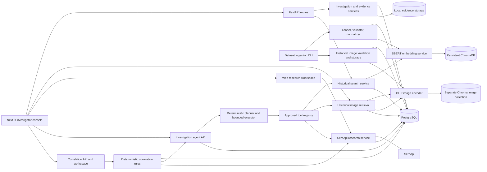

# ColdSync AI architecture

## Service boundaries

- **Web:** Next.js investigator console. It uses one typed REST client and never receives provider credentials.
- **API:** FastAPI routes validate requests and call domain services. Pydantic schemas define stable response/request boundaries.
- **PostgreSQL:** authoritative investigations, evidence metadata/content, historical cases, and vector-index state.
- **Evidence storage:** local adapter stores uploaded bytes beneath UUID-generated directories. The database stores relative keys; content routes resolve keys only inside the storage root.
- **ChromaDB:** persistent semantic index for historical cases. Chroma IDs identify records; result details are loaded from PostgreSQL.
- **SBERT:** lazily loaded model reused per process and batch-encodes historical-case text. No external AI API is used for Phase 3.
- **CLIP:** lazily loaded Transformers image encoder. Historical image vectors use the separate `historical_case_images` Chroma collection; uploaded evidence vectors are cached in PostgreSQL with model version metadata.
- **SerpApi:** backend-only HTTP client persists run/search/result/source records and evidence links in PostgreSQL. Web, Google News, News tab, and Google Images searches remain separately labeled; credentials and direct provider calls stay out of the frontend.
- **Investigation agent:** deterministic planner and persisted bounded executor. It calls only approved Phase 3, 4, and 5 service methods through a tool registry; each action is audited and public searches link to their Phase 5 research run.
- **Correlation engine:** bounded deterministic rules consume persisted agent match traces and Phase 5 research results. Polymorphic record references retain provenance, and investigator review history is stored separately.
- **Historical image files:** copied from dataset-relative paths into a separate local storage root and served through a path-checked API. Dataset image URLs are provenance only and are never fetched automatically.

## Migrations

Alembic revisions create investigations (`0001_initial`), evidence (`0002_evidence`), historical cases plus text vector index state (`0003_historical`), CLIP evidence cache plus historical image/index state (`0004_clip_visual`), research runs/searches/sources/results/evidence links (`0005_web_research`), agent runs/actions plus the nullable Phase 5 agent-run reference (`0006_investigation_agent`), and evidence correlations plus investigator review history (`0007_evidence_correlations`). Compose runs `alembic upgrade head` before Uvicorn starts.

## Historical data and retrieval

The dataset CLI loads CSV/JSON/JSONL using a configurable path. It validates rows, normalizes nullable values and dates, creates stable fingerprints when source IDs are absent, and builds `text_content` only from fields present. PostgreSQL is authoritative; Chroma stores vectors, documents, and filter metadata. Index state/counts are persistent. A forced rebuild writes a staging collection and swaps the active name after count verification. Evidence search validates investigation ownership and requires selected evidence to contain text; its response lists selected evidence names/IDs for traceability.

Semantic similarity is a retrieval signal only. Search results remain potentially relevant research leads and require verification. Provenance fields are returned only if present in source records; URLs are not generated.

## Environment

`SBERT_MODEL_NAME`, `SBERT_BATCH_SIZE`, `SBERT_DEVICE`, `CHROMA_HOST`, `CHROMA_PORT`, `CHROMA_PERSIST_DIRECTORY`, and `HISTORICAL_CASE_DATASET_PATH` configure Phase 3. `SERPAPI_API_KEY`, localization, timeouts, bounded query/result settings, mock mode, and the application request limit configure Phase 5. `AGENT_MAX_ITERATIONS`, `AGENT_MAX_ACTIONS_PER_ITERATION`, `AGENT_MAX_SERPAPI_QUERIES`, `AGENT_MAX_RESULTS`, `AGENT_MAX_HISTORICAL_SEARCHES`, `AGENT_MAX_IMAGE_SEARCHES`, and `AGENT_MAX_TOTAL_ACTIONS` bound Phase 6. Docker Compose persists Chroma and model-cache data in named volumes and mounts local dataset inputs read-only.

Phase 4 adds `CLIP_MODEL_NAME`, `CLIP_DEVICE`, `CLIP_BATCH_SIZE`, and `HISTORICAL_IMAGE_STORAGE_DIR`. Dataset image paths must resolve within the dataset directory. Image URLs are provenance references and are not fetched. CLIP and SBERT retrieval stay separate; no cross-modal score is produced.

## Current limits

No historical dataset or historical image corpus is bundled. Visual similarity is a retrieval signal only and does not establish identity or prove two images depict the same subject. Public web results are source leads and require investigator review. Phase 6 uses a deterministic planner; Phase 7 correlation rules are deterministic and bounded. Correlation is a research lead, not proof. Entity extraction is conservative (formatted dates/IDs and explicitly labeled entities/metadata), and only Bangalore/Bengaluru are configured as a location alias. Direct Phase 3/4 search results are not persisted outside agent action traces. Correlation generation caps inputs and records per run; counts and truncation are returned by the run endpoint. Investigator feedback does not train a model. The application has no authentication/ownership layer. Neither phase includes Gemini synthesis, cross-modal scoring, or automated investigative conclusions. Agent tasks run in API background workers, so process restarts interrupt in-flight work; persisted run state and action trace remain available.
